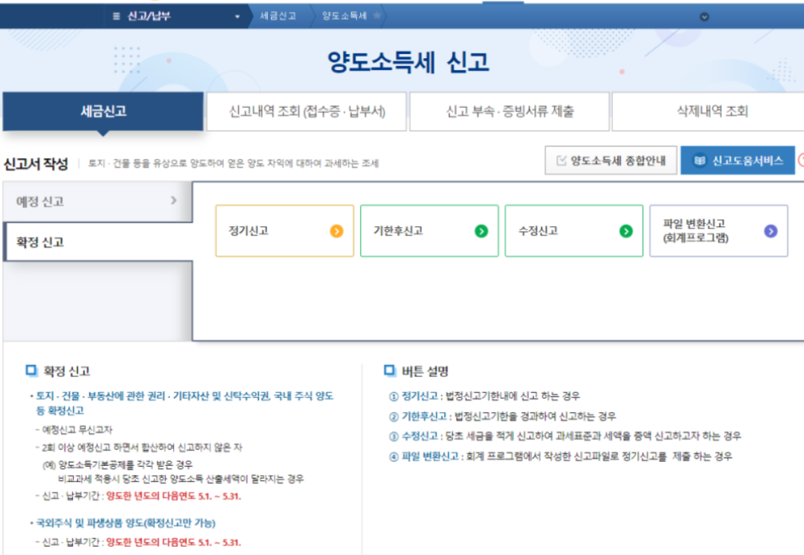
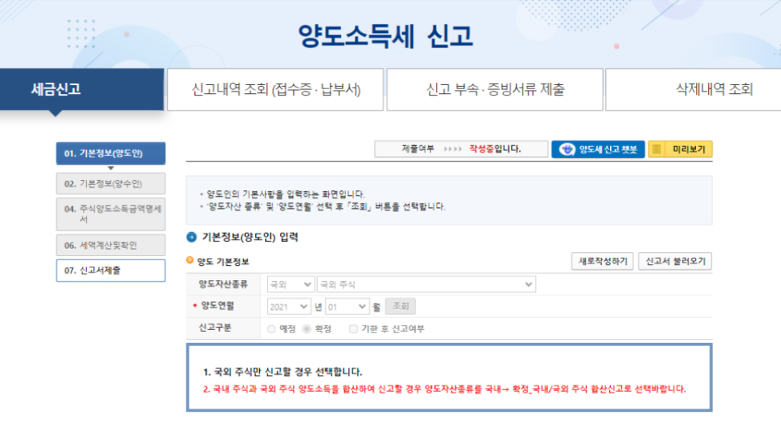
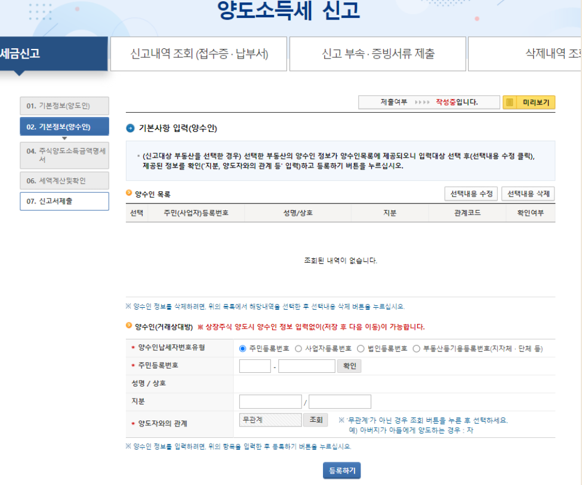

::: info
완벽한 양도소득세를 내는 방법은 아닙니다. 완벽한 것은 세무사 통해서 내시는게 좋습니다.
:::

# 홈텍스를 통해 `해외 주식` 양도소득세를 내보자

> 홈택스 홈페이지의 양도소득세 신고 -> 확정신고 -> 정기신고로 들어간다
> (신고기간 5/1 ~ 5/31)



> 양도 기본정보는 `국외 - 국외주식` 으로 입력한다
> 신고인 정보 저장후 다음으로 이동



> 매도를 했을 경우 양수인은 별도로 없고 `본인`으로 아무것도 입력안하고 Pass



> 이제부터는 주식에 대한 정보를 입력해주어야 한다.
> 증권 거래소 마다 다르기 때문에 각자의 주식에 대한 조회 방법을 참고 해야 함.

```md
* `주식 종목명` = 증권사 내역 종목명
* `국내/국외 구분` = 2
* `취득유형별 양도주식수` = 증권사 내역의 매도수량
* `세율구분, 주식등종류` = 61
* `양도물건종류` = 10
* `취득유형` = 01 (1로 입력되면 안됨, 01로 입력 필수)
* `양도일자` = 증권사 내역의 매도일 (YYYY-MM-DD 형식으로 작성)
* `주당양도가액` = 증권사 내역 매도단가
* `양도가액` = 증권사 내역 매도금액
* `취득일자` = 증권사 내역 매수일
* `주당 취득가액` = 증권사 내역 매수단가
* `취득가액` = 증권사 내역 매수금액
* `필요경비` = 증권사 내역 필요경비
* `국외자산국가코드` = 미국 US
```

> 양도소득공제에 250만원 입력후 등록
> 내용확인 후, 신고서 제출 + 지방세 납부 + 양도소득세 납부 하면 끝. 

# 참고사항
* 나중에 다시 양도소득세 낼때 참고 용으로 남기는 문서. 
* 날짜, 기간, 시간 지남에 따라 홈텍스 홈페이지, 필요 문서가 달라질 수 있으므로 참고용으로만 사용해야함.
