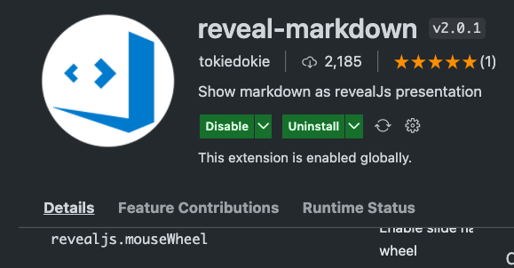

# Reveal in Vscode

---

# Reveal
* reveal.js는 ppt처럼 발표 슬라이드를 구성하는데 사용하는 도구
* html, css, javascript를 이용해서 구성됨

--

[reveal](https://github.com/hakimel/reveal.js)
* npm에서 받아서 세팅해서 사용하는게 기본 방법임.

---

# reveal-markdown
* vscode에서 reveal.js를 쉽게 사용 할 수 있도록 해주는 extension

--

## tutorial
```markdown
---
theme : "night"
transition: "slide"
highlightTheme: "moon"
slideNumber: false
title: "VSCode Reveal intro"
---
```
* 위와 같이 markdown파일 상단에 설정을 해준다.

--

## 웹 뷰로 보기

---

# TODO
* reveal에서 사용될 이미지는 연결을 어떻게 할 수 있을까?

---


---

END
---
