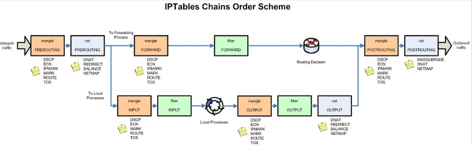

# iptables의 Chain(Rule) & Table 구조
* iptables는 다수의 chain()과 그 chain에 정의된 Rule, 그리고 각 chain에는 다수의 table(raw, mangle, nat, filter, security)이 포함 됨.

|Rule Name|raw|filter|nat|mangle|security|
|--|--|--|--|--|--|
|preouting|✔||✔|✔||
|input||✔|✔|✔|✔|
|output||✔|✔|✔|✔|
|postrouting|||✔|✔|✔|
|forward|✔|✔||✔|✔|

https://andrewpage.tistory.com/38?category=1215601