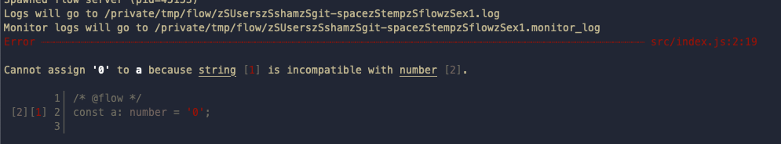

# 레퍼런스
* [flow.org](https://flow.org/)
* [flow](https://github.com/facebook/flow)

# 서론
* 순수 javascript를 쓰면서 고통이 너무 많은거 같아서 개발 할땐 javascript에선 type을 체크 못하는가 찾아보다가 알게된 `flow`에 대해 설명하고자 한다.

# typescript와 무엇이 다른가?
* typescript는 모두가 알듯이 type을 명시적으로 사용하겠다 하여 컴파일러를 통해 .ts -> .js로 변환하여 사용하는 언어
* flow는 .js로 작성된 script에 flow관련된 명령어(eslint와 비슷? 유사?)한 느낌으로 적용하여 .js로 구현된 코드에서 type에 대해 검사해주는 `tool` 이다

# [설치](https://flow.org/en/docs/install)
* 위의 링크를 참고하면 손쉽게 설치 가능. 
* 패키지 툴은 yarn과 npm, 컴파일러는 babel과 flow-remove-types가 있음.

# 설정
> flow-remove-types를 통하여 테스트함
```json
  "scripts": {
    "build": "flow-remove-types src/ -d dist/",
    "flow": "flow"
  },
```
* 위와 같이 package.json에 설정하여 사용 할 수 있도록 해두면 사용 하기 편하다

# 검사 방법
1. 검사할 .js 파일에 아래와 같이 flow주석을 달아주면 해당 파일에 대해 검사를 할 수 있게됨
```js
// @flow
const a: number = '0';
```

2. 실행
```sh
$ npm run flow
```


* 위와 같이 에러가 발생하는 것을 볼 수 있게 된다.

# +@ 정보
* flow를 vscode에서도 사용을 할 수 있다.
* [flowtype.flow-for-vscode](https://marketplace.visualstudio.com/items?itemName=flowtype.flow-for-vscode)에 설치 및 사용방법이 자세히 나와있어서 별도 글 X


# 후기
* TS를 쓰는게 개인적으로는 더 좋지만 어쩔 수 없이 JS를 써야만 한다면 도구의 힘을 빌려 타입을 체크 해보는 것도 도움되지 않을까란 생각.