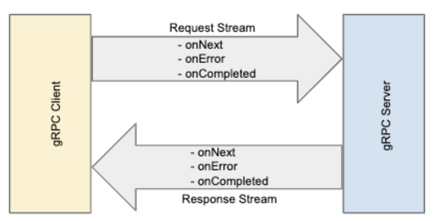
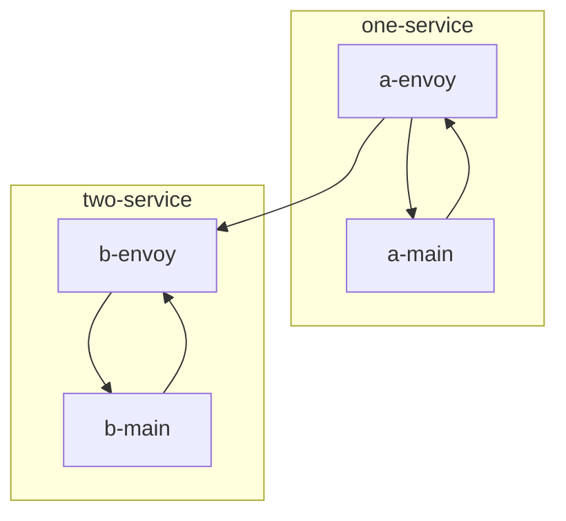
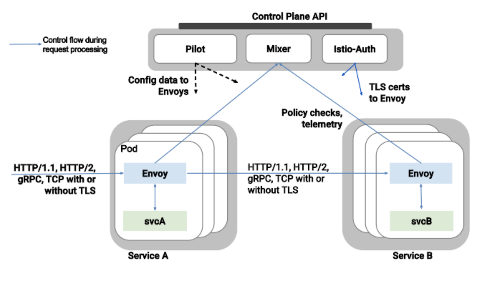

# grpc and istio 훑어보기

# How does the data flow from gRPC at 'istio'?

> gRPC의 경우 `HTTP/2`를 사용 하므로 Service간 Connection을 끊지 않은 상태로 유지하며 data를 전송하고 전달 받는다.
> `Connection을 유지 하게 되면 LB의 경우 어떤 식으로 동작하지란?` 의문에서 문서 작성.

## [Envoy](https://www.envoyproxy.io)

* 고성능 프록시 사이드카로서 service mesh의 모든 서비스에 대한 inbound/outbound 트래픽을 처리 하는 컴포넌트.
* proxy 역할을 수행하며 비지니스 로직을 처리 하는 pod 에 sidecar 패턴 형태로 같이 배포되어 모든 서비스에 대한 In/Out bound 트래픽을 조정하는 역할을 한다.

### 기능

* dynamic service discovery
* load balancing,
* TLS termination
* HTTP/2 & gRPC proxying,
* circuit breakers
* health checks
* based traffic split
* fault injection
* 모니터링
* etc

### 레퍼런스
* [What is Envoy Proxy](https://www.envoyproxy.io/docs/envoy/latest/)

---
## [Istio](https://istio.io)
* Istio는 조직에서 분산형 마이크로서비스 기반 앱을 어디서나 실행할 수 있도록 지원하는 오픈소스 서비스 메시.
* Istio를 통해 조직은 분산형 애플리케이션을 대규모로 제공.
* 왜 Istio를 사용해야 하나요?
  * Istio를 통해 마이크로서비스를 보호, 연결, 모니터링할 수 있으므로 엔터프라이즈 앱을 더욱 빠르고 안전하게 사용할 수 있기 때문에

---
## [gRPC](https://grpc.io)

* gRPC는 Google에서 개발한 RPC(Remote Procedure Call) 시스템.
* 전송을 위해 `TCP/IP 프로토콜`과 `HTTP 2.0 프로토콜`을 사용
* IDL(Interface Definition language)로 `protocol buffer`를 사용

---
## gRPC with Istio & Envoy
### Summary

* Application의 통신은 Sidecar 로 함께 있는 envoy로 gRPC 통신하게 된다.
* `Traffic 컨트롤`은 envoy와 istio통해서 이루어진다.

> ps. 자세한 Istio의 Traffic Control은 [링크](https://istio.io/latest/docs/concepts/traffic-management) 참고

> *아래내용만은 기억하자*
> * traffic control은 istio에서
> * 연결 자체는 `envoy`를 통해 grpc 클라이언트 & 서버가 연결

---
# 기타
* [Google Anthos](https://cloud.google.com/anthos?hl=ko)
* [Dataflow and gRPC — using at scale](https://medium.com/engineering-at-palo-alto-networks/dataflow-and-grpc-using-at-scale-9612303dfe0b)
  * gRPC를 효율적으로 사용 하기 위한 몇가지 중요 포인트를 이야기 해주고 있음.
    1. Control number of streams
    2. Use Flow Control
    3. Bi-directional streams, each stream has own life span
    4. Exponential Backoff
    5. gRPC Buffer 
* [grpc-core options](https://grpc.github.io/grpc/core/group__grpc__arg__keys.html#details)
* [gRPC Concepts Overview](https://chromium.googlesource.com/external/github.com/grpc/grpc/+/HEAD/CONCEPTS.md)
