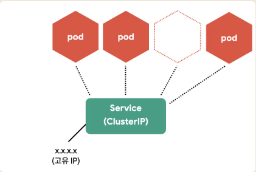
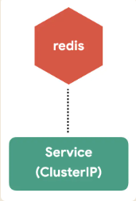
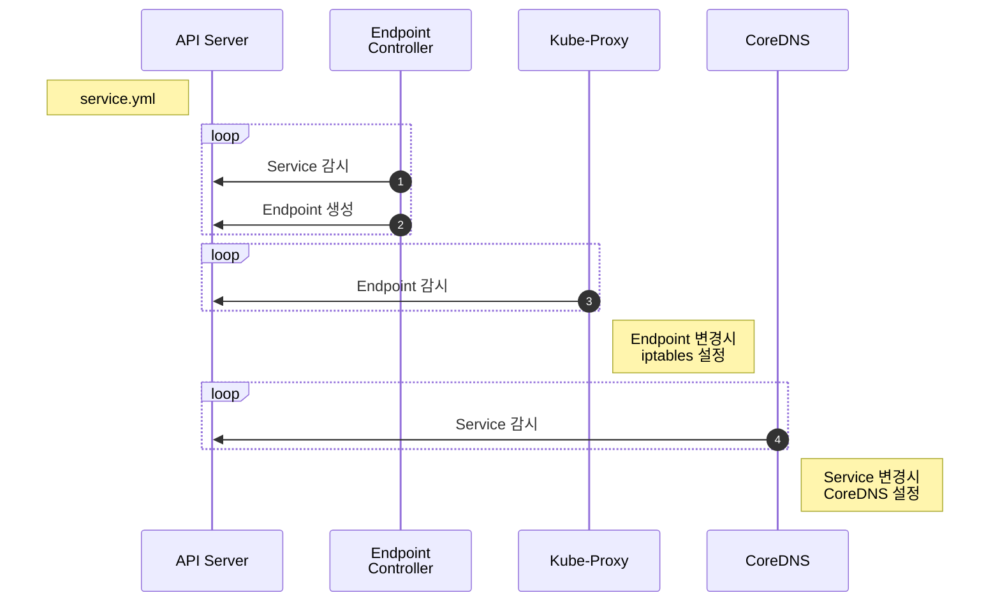
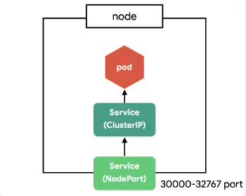
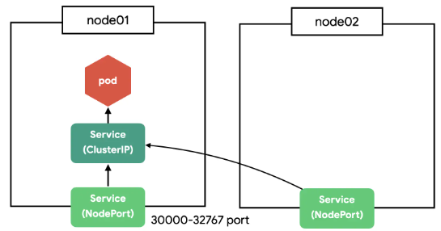
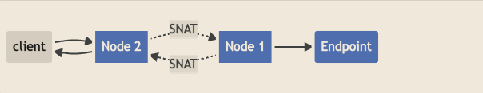
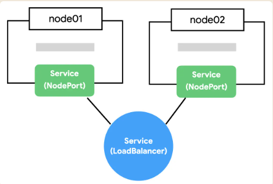

# k8s Service들에 대한 이야기
* k8s svc에 대한 정의와 어디에 사용 하는지에 대한 설명을 적어봅니다.

# Service
> Pod은 자체 IP를 가지고 다른 Pod과 통신할 수 있지만, 쉽게 사라지고 생성되는 특징 때문에 직접 통신하는 방법은 권장하지 않고 있다.
> k8s는 Pod과 직접 통신하는 방법 대신, 별도의 고정된 IP를 가진 서비스를 만들고 그 서비스를 통해 Pod에 접근하는 방식을 사용 하고 있다.
> 그걸 할 수 있도록 도와 주는게 Service이다



이런 개념은 처음 접하였을때 어려웠다!
개념도 생소하고 노출 범위에 따라 `CluterIP`, `NodePort`, `LoadBalancer` 으로 나누어져 더욱 어렵게 되어있었다.

::: warning
서비스 종류 중에 `ExternalName`도 있지만 여기서는 다루지 않았다. 중요 3총사만 확인하고 남겨본다.
:::

## Service(ClusterIP) 만들기

ClusterIP는 클러스터 내부에 새로운 IP를 할당하고, 여러 개의 Pod을 바라보는 로드밸런서 기능을 제공한다.
그리고 서비스 이름을 내부 도메인 서버에 등록하여 Pod 간에 서비스 이름으로 통신할 수 있다.

Backend DB 중에 redis를 통해 예제를 만들어보았다.

```yml
apiVersion: apps/v1
kind: Deployment
metadata:
  name: redis
spec:
  selector:
    matchLabels:
      app: test
      tier: db
  template:
    metadata:
      labels:
        app: test
        tier: db
    spec:
      containers:
        - name: redis
          image: redis
          ports:
            - containerPort: 6379
              protocol: TCP
---
apiVersion: v1
kind: Service
metadata:
  name: redis
spec:
  ports:
    - port: 6379
      protocol: TCP
  selector:
    app: test
    tier: db
```

redis를 먼저 실행 해서 만들어보자.
```sh
$ kubectl apply -f test-redis-svc.yml

# Pod, ReplicaSet, Deployment, Service 상태 확인
$ kubectl get all
```

*실행 결과*
```sh
NAME                         READY   STATUS    RESTARTS   AGE
pod/redis-67d485db42-mf5w5   1/1     Running   0          24s

NAME                 TYPE        CLUSTER-IP      EXTERNAL-IP   PORT(S)    AGE
service/kubernetes   ClusterIP   10.76.0.1       <none>        443/TCP    19h
service/redis        ClusterIP   10.103.50.52   <none>        6379/TCP   24s

NAME                    READY   UP-TO-DATE   AVAILABLE   AGE
deployment.apps/redis   1/1     1            1           24s

NAME                               DESIRED   CURRENT   READY   AGE
replicaset.apps/redis-67d485db42   1         1         1       24s
```

redis Deployment와 Service가 생성된 것을 볼 수 있다.



같은 클러스터에서 생성된 Pod이라면 `redis`라는 도메인으로 redis Pod에 접근 할 수 있다. (`redis.default.svc.cluster.local`로도 접근가능 하다. 서로 다른 namespace와 cluster를 구분할 수 있다.)

CluterIP 서비스의 설정을 살펴보자.

| Define                  | Description                                         |
| --------------------- | -------------------------------------------- |
| `spec.ports.port`       | 서비스가 생성할 Port                           |
| `spec.ports.targetPort` | 서비스가 접근할 Pod의 Port (기본: port랑 동일) |
| `spec.selector`         | 서비스가 접근할 Pod의 label 조건               |

`redis Service`의 `selector`는 redis Deployment에 정의한 label을 사용했기 때문에 해당 Pod을 가리킨다.
그리고 해당 Pod을 6379 포트로 연결하였다.

이제 redis에 접근할 test 앱을 deployment로 만든다.
```yml
apiVersion: apps/v1
kind: Deployment
metadata:
  name: test
spec:
  selector:
    matchLabels:
      app: test
      tier: app
  template:
    metadata:
      labels:
        app: test
        tier: app
    spec:
      containers:
        - name: test
          image: ghcr.io/subicura/test:latest
          env:
            - name: REDIS_HOST
              value: "redis"
            - name: REDIS_PORT
              value: "6379"
```
test app Pod에서 redis Pod으로 접근이 되는지 테스트 해보자.

```sh
$ kubectl apply -f test-app.yml

# test app에 접근
$ kubectl get po
$ kubectl exec -it $(k get po -lapp=test --output=jsonpath={.items[0].metadata.name}) -- sh

# curl localhost:3000 또는 telnet redis 6379
>  dbsize
>  KEYS *
>  GET count
```

Service를 통해 Pod과 성공적으로 연결할 수 있다.

## Service 생성 Flow
> Service는 각 Pod를 바라보는 로드밸런서 역할을 하면서 내부 도메인서버에 새로운 도메인을 생성한다. 
> Service가 어떻게 동작하는지 살펴보자.


1. `Endpoint Controller`는 `Service`와 `Pod`을 감시하면서 조건에 맞는 Pod의 IP를 수집
2. `Endpoint Controller`가 수집한 IP를 가지고 `Endpoint` 생성
3. `Kube-Proxy`는 `Endpoint` 변화를 감시하고 노드의 iptables을 설정
4. `CoreDNS`는 `Service`를 감시하고 서비스 이름과 IP를 `CoreDNS`에 추가

`iptables`는 커널<sup>kernel</sup> 레벨의 네트워크 도구이고 `CoreDNS`는 빠르고 편리하게 사용할 수 있는 클러스터 내부용 도메인 네임 서버이다. 각각의 역할은 `iptables` 설정으로 여러 IP에 트래픽을 전달하고 `CoreDNS`를 이용하여 IP 대신 도메인 이름을 사용한다.

::: tip
iptables는 규칙이 많아지면 성능이 느려지는 이슈가 있어, `ipvs`를 사용하는 옵션도 있다.
:::

::: tip
CoreDNS는 클러스터에서 호환성을 위해 `kube-dns`라는 이름으로 생성된다.
:::

갑자기 Endpoint가 나왔다. Endpoint는 서비스의 접속 정보를 가지고 있다. 

Endpoint의 상태를 살펴보면 아래와 같이 볼 수 있다.
```sh
$ kubectl get endpoints
$ kubectl get ep #줄여서

# redis Endpoint 확인
$ kubectl describe ep/redis
```

*실행 결과*

```sh
Name:         redis
Namespace:    default
Labels:       <none>
Annotations:  endpoints.kubernetes.io/last-change-trigger-time: ...
Subsets:
  Addresses:          172.17.0.2
  NotReadyAddresses:  <none>
  Ports:
    Name     Port  Protocol
    ----     ----  --------
    <unset>  6379  TCP
Events:  <none>
```

Endpoint Addresses 정보에 Redis Pod의 IP가 보이게 된다. (Replicas가 여러개였다면 여러 IP가 보인다.)

## Service(NodePort) 만들기

`CluterIP`는 클러스터 내부에서만 접근할 수 있다. 
클러스터 외부(노드)에서 접근할 수 있도록 `NodePort` 서비스를 만들어보자.

```yml
apiVersion: v1
kind: Service
metadata:
  name: test-np
spec:
  type: NodePort
  ports:
    - port: 3000
      protocol: TCP
      nodePort: 31001
  selector:
    app: test
    tier: app
```

| Define                 | Description                                                     |
| --------------------- | -------------------------------------------------------- |
| `spec.ports.nodePort` | Node에 오픈할 Port (미지정시 30000-32768 중에 자동 할당됨) |

`test app`을 해당 노드의 31001으로 오픈하였다.

```sh
$ kubectl apply -f test-nodeport.yml

# 서비스 상태 확인
$ kubectl get svc
```

*실행 결과*

```sh
NAME         TYPE        CLUSTER-IP       EXTERNAL-IP   PORT(S)          AGE
test-np   NodePort    10.101.168.120   <none>        3000:31001/TCP   54s
kubernetes   ClusterIP   10.76.0.1        <none>        443/TCP          19h
redis        ClusterIP   10.103.50.52    <none>        6379/TCP         40m
```

`minikube ip`로 테스트 클러스터의 노드 IP를 구하고 31001으로 접근해보자.

```sh
$ curl 192.168.64.4:31001
```

::: warning
Docker driver를 사용중이라면 `minikube service test-np` 명령어를 이용하여 접속하면 된다.
:::



`NodePort`는 클러스터의 모든 노드에 포트를 오픈하여 접근 할 수 있도록 한다. 
지금은 하나의 노드밖에 없지만 여러 개의 노드가 있다면 아무 노드로 접근해도 지정한 Pod으로 쏘옥 접근할 수 있다.



::: tip
NodePort는 CluterIP의 기능을 기본으로 포함한다.
:::

::: warning
Type=NodePort인 서비스로 보내진 패킷은 소스 NAT가 기본으로 적용된다. 그래서 명심할 것은 `NodePort`로 들어온 요청은 정확한 클라이언트 IP 주소가 아니고, 클러스터 내부 IP 주소가 될 수 있다.
시각적으로 

이를 피하기 위해 `externalTrafficPolicy: Local`옵션을 사용 해야함을 잊지 말자.
:::

## Service(LoadBalancer) 만들기

NodePort의 단점은 노드가 사라졌을 때 자동으로 다른 노드를 통해 접근이 불가능하다는 점이다. 
예를 들어, 3개의 노드가 있다면 3개 중에 아무 노드로 접근해도 `NodePort`로 연결할 수 있지만 어떤 노드가 살아 있는지는 알 수는 없다.



자동으로 살아 있는 노드에 접근하기 위해 모든 노드를 바라보는 `Load Balancer`가 필요하다. 
Client는 NodePort에 직접 요청을 보내는 것이 아니라 `Load Balancer`에 요청하고 Load Balancer가 알아서 살아 있는 노드에 접근하면 NodePort의 단점을 없앨 수 있다.

Load Balancer를 생성해 보자.

```yml
apiVersion: v1
kind: Service
metadata:
  name: test-lb
spec:
  type: LoadBalancer
  ports:
    - port: 30000
      targetPort: 3000
      protocol: TCP
  selector:
    app: test
    tier: app
```

```sh
$ kubectl apply -f test-lb.yml
```

*실행 결과*

```sh
NAME         TYPE           CLUSTER-IP       EXTERNAL-IP   PORT(S)           AGE
test-lb   LoadBalancer   10.109.50.21   <pending>     30000:31535/TCP   50s
test-np   NodePort       10.101.168.120   <none>        3000:31001/TCP    54m
kubernetes   ClusterIP      10.76.0.1        <none>        443/TCP           20h
redis        ClusterIP      10.103.50.52    <none>        6379/TCP          60m
```

test-lb가 생성되었지만, `EXTERNAL-IP`가 `<pending>`인 것을 확인할 수 있다.
하지만 `Load Balancer`는 `AWS`, `Google Cloud`, `Azure` 같은 클라우드 환경이 아니면 사용이 제한적일 수 있다.
특정 서버(Node)를 가리키는 무언가(Load Balancer)가 필요한데 이런 `무언가`가 가상머신이나 로컬 서버에는 존재하지 않기 때문이다.

### minikube에 가상 LoadBalancer 만들기

Load Balancer를 사용할 수 없는 환경에서 가상 환경을 만들어 주는 것이 `MetalLB`라는 것이다. minikube에서는 현재 떠 있는 노드를 Load Balancer로 설정한다. minikube의 `addons` 명령어로 활성화할 수 있다.

```sh
minikube addons enable metallb
```

그리고 `minikube ip`명령어로 확인한 IP를 ConfigMap으로 지정해야 한다.

minikube를 이용하여 손쉽게 metallb 설정을 할 수 있다.

```sh
minikube addons configure metallb

-- Enter Load Balancer Start IP: # minikube ip 결과값 입력
-- Enter Load Balancer End IP: # minikube ip 결과값 입력
    ▪ Using image metallb/speaker:latest
    ▪ Using image metallb/controller:latest
✅  metallb was successfully configured
```

minikube를 사용하지 않고 직접 ConfigMap을 작성할 수도 있다.

```yml
apiVersion: v1
kind: ConfigMap
metadata:
  namespace: metallb-system
  name: config
data:
  config: |
    address-pools:
    - name: default
      protocol: layer2
      addresses:
      - 192.168.64.4/32 # minikube ip
```

```sh
$ kubectl apply -f metallb-cm.yml

# 다시 서비스 확인
$ kubectl get svc
```

*실행 결과*

```sh
NAME         TYPE           CLUSTER-IP       EXTERNAL-IP   PORT(S)           AGE
test-lb   LoadBalancer   10.109.50.21   192.168.64.4  30000:31535/TCP   10m
test-np   NodePort       10.101.168.120   <none>        3000:31001/TCP    34m
kubernetes   ClusterIP      10.76.0.1        <none>        443/TCP           21h
redis        ClusterIP      10.103.50.52    <none>        6379/TCP          60m
```

이제 `192.168.64.4:30000`으로 접근해면

::: warning
Docker driver를 사용중이라면 `minikube service test-lb` 명령어를 이용하여 접속하면 된다.
:::

::: tip
LoadBalancer는 NodePort의 기능을 기본으로 포함된다.
:::

## 마무리

`k8s 서비스`는 low level 수준의 네트워크를 이해하고 성능, 보안 이슈를 신경 써야 한다.
파고들면 한없이 복잡하고 어려운 부분이 많아서 일단 그렇구나.. 하고 넘어가는게 맘이 편하였다...

실전에선 NodePort와 LoadBalancer를 제한적으로 사용한다.
보통 웹 애플리케이션을 배포하면 80 또는 443 포트를 사용하고 하나의 포트에서 여러 개의 서비스를 도메인이나 경로에 따라 다르게 연결하기 때문이다. 

## 참고

* [Service v1 core](https://kubernetes.io/docs/reference/generated/kubernetes-api/v1.24/#service-v1-core)
* [k8s 네트워크](https://www.edureka.co/blog/kubernetes-networking)
