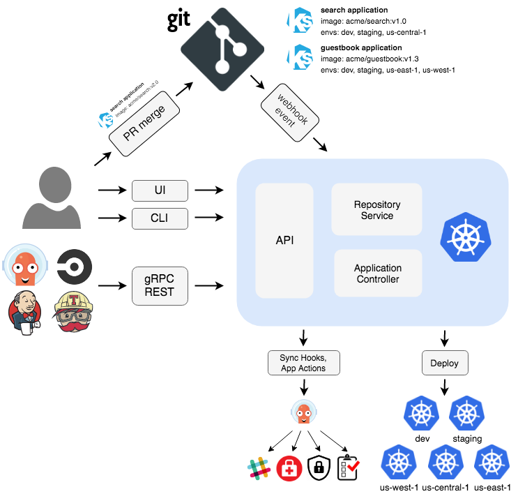
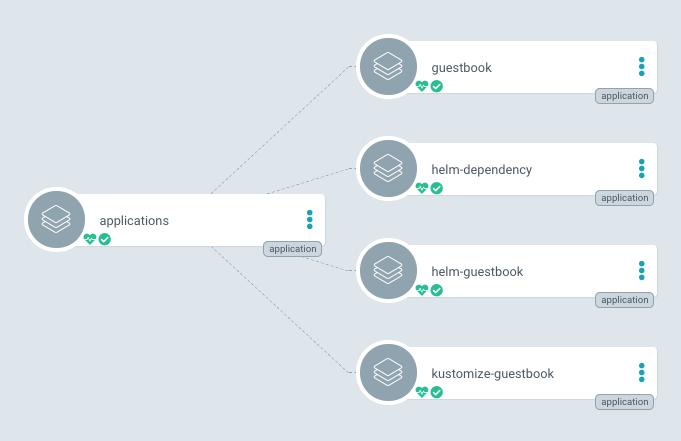

# GitOps

> - program의 소스코드를 지속적으로 개발하고 관리해 나가기 위해서 Git를 사용하는 것처럼 일련의 `시스템 구성요소를 선언적인(declarative) 코드로 정의하고 Git repository를 통해 지속적으로 관리 및 확장에 나가는 방식`을 `GitOps`라고 합니다.



> Git을 비롯한 일련의 code repository들은 코드가 생성되고 수정되고 삭제되는 일련의 과정을 기록하고 검증하며, 변경한 내용을 적용하거나 되돌리고 작업자를 추적할 수 있는 기능을 제공합니다.

## GitOps의 구현체 [ArgoCD](https://argoproj.github.io/argo-cd/)

- ArgoCD는 GitOps 방식으로 관리되는 `manifest` 파일의 변경사항을 확인하며, 현재 배포된 환경의 상태와 Github manifest 파일에 정의된 상태를 동일하게 유지하는 역할을 수행합니다.

### 컴포넌트

- Api 서버와 타겟 git 소스를 클론 받아 매니페스트를 관리하는 레파지토리 서버
- 생성된 매니페스트와 실제 리소스를 비교/싱크하는 컨트롤러 서버

### 동작

- 템플릿이 담긴 git 소스를 지정하면 각 컴포넌트를 거쳐 Targe 클러스터에 해당 리소스를 배포하는 구조입니다.

### [App of Apps Pattern](https://argoproj.github.io/argo-cd/operator-manual/cluster-bootstrapping/#app-of-apps-pattern)



1. 각 App Bundle에 대한 프로젝트 분리
2. 환경별 app bundle 및 프로젝트 관리
3. 별도의 저장소에 애플리케이션 정의 관리

[`ArgoCD Example Apps`](https://github.com/argoproj/argocd-example-apps)

#### Helm Example

```
ArgoCD Charts Repository
├── AppOfApps
|       ├── templates
|       |   ├── guestbook.yaml
|       |   ├── helm-dependency.yaml
|       |   ├── helm-guestbook.yaml
|       |   └── kustomize-guestbook.yaml
|       ├── Chart.yaml
|       └── values.yaml
├── istio
└── prometheus
```

### 장점

- 인프라 스트럭쳐 가시성 향상
- 신규 인프라 클러스터 구성 속도 향상
- 클러스터 수정에 대한 히스토리 추적 가능

### 단점

- 사용하기 어려운 서비스 형태도 있음
