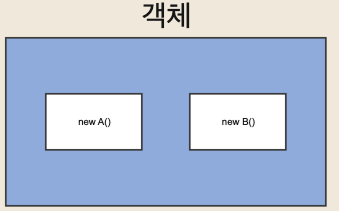
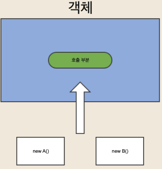
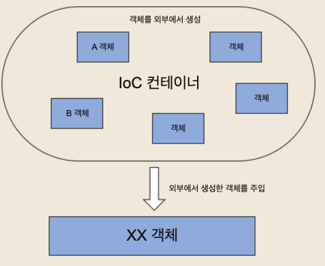

# DI(Dependency Injection)
* 스프링이 다른 프레임워크와 차별화되어 제공하는 의존 관계 주입 기능

## 기본 객체 생성 형태

## DI 패턴 객체 생성 형태

* 외부에서 객체를 생성해서 주입(injection)하는 형태로 사용하는 패턴을 이야기 한다
### 장점
* 객체간의 의존성이 줄어 듦
* 의존성이 감소함에 따라 유지보수가 용이해짐

### 사용하는 이유
* 객체 내부에서 다른 객체를 생성하는 것은 강한 결합도를 가지는 구조. 객체를 주입받는 다는 것은 외부에서 생성된 객체를 인터페이스를 통해서 넘겨받는 것이기 때문에 결합도를 낮출 수 있고, 런타임시에 의존관계가 결정되기 때문에 유연한 구조를 가짐.
* new를 통해 직접 객체를 생성할 경우, 내용을 수정할 때 코드를 수정해야 함. 하지만, DI를 사용할 경우, 이를 정의하고 있는 파일만 수정하면 됨.

# IoC(Inversion of Control)
* 객체를 생성하고 객체 간의 의존 관계를 프레임워크가 대신 해주는 것을 의미

* IoC 컨테이너에서 객체들을 제어

## 장점
* 결합도 제거
  * 종속성이 감소해 변경에 민감하지 않음.
* 재사용 코드
  * 일부 인터페이스의 다른 구현이 필요한 경우, 해당 구현을 사용해 components를 구성할 수 있음
* 테스트 코드
  * 더 많은 테스트 코드 생성 가능함.
  * Mock 객체는 실제 구현의 테스트로 사용하는 객체로, 종속성을 components에 주입할 수 있을 경우, mock 구현 주입이 가능함.
* 가독성 코드
  * components의 종속성을 보다 쉽게 파악 가능