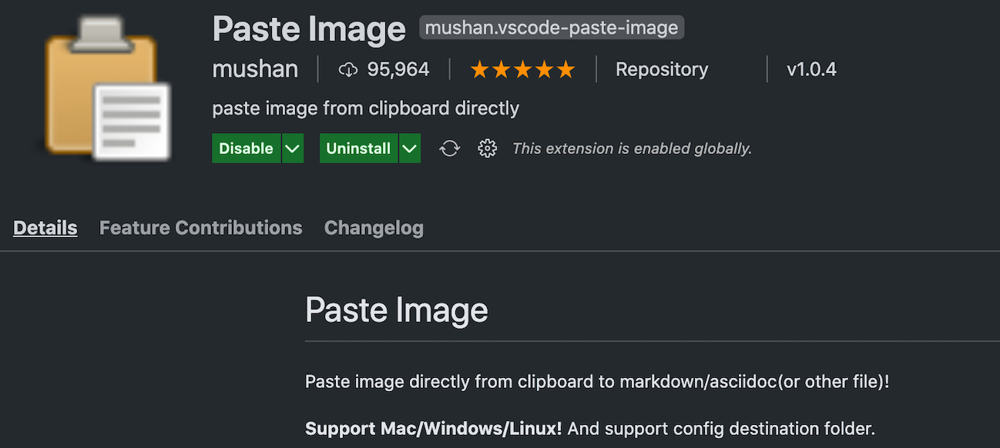
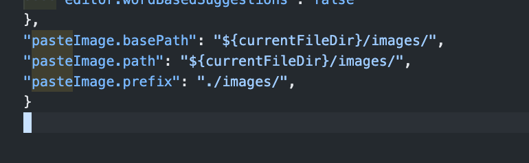
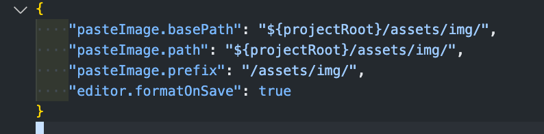

# VSCODE에서 Markdown 작성 시 편리하게 이미지 넣는법

MD로 문서를 작성할때 스크린캡쳐 받은 이미지를 저장하고 링크를 거는 것이였음. (저장 -> 경로 복사 -> MD에 태그해서 복사) 어려운 작업은 아니지만 이미지가 많을 경우 여간 성가신 것아니였다!
이런 불편함 때문에 MD로 작성하는 것을 포기 하였었는데... 최근에 찾아보니 누군가 엄청난 extension을 개발해두었어서 해당 문서 작성!

## Paste Image

## 사용법
* extension 에 설명이 잘 되어있으므로 문서 참고.
* 쉽게 `이미지 클립보드 저장 -> 붙여 넣기(mac기준 cmd + option + v)` 하면 경로를 지정해주면서 저장 시켜줌.
* markdown 문서에 붙인 이미지의 경우, 해당 `시점`의 값을 가지고 파일이 저장되게 된다.
* 환경에 따라 단축키가 다를 수 있기 때문에 Issue도 참고 하면 좋음.

## 설정 추천
* 아래 설정과 같이 3개만 추가 하고, 기본값을 사용 하였다.
* 아래와 같이 설정하면 붙여넣기 하는 md파일 위치에 `images`를 만들고, md 파일 경로에 `./images/`를 추가하여준다.

## 현재 블로그 project 설정

## path options
`pasteImage.path`

> The destination to save image file.

You can use variable:
* ${currentFileDir}: the path of directory that contain current editing file.
* ${projectRoot}: the path of the project opened in vscode.
* ${currentFileName}: the current file name with ext.
* ${currentFileNameWithoutExt}: the current file name without ext.

