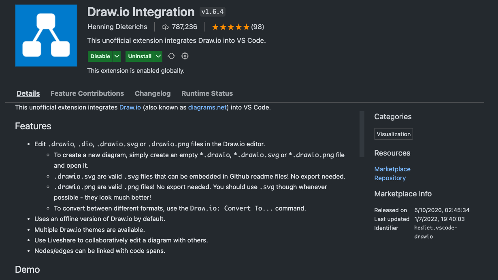
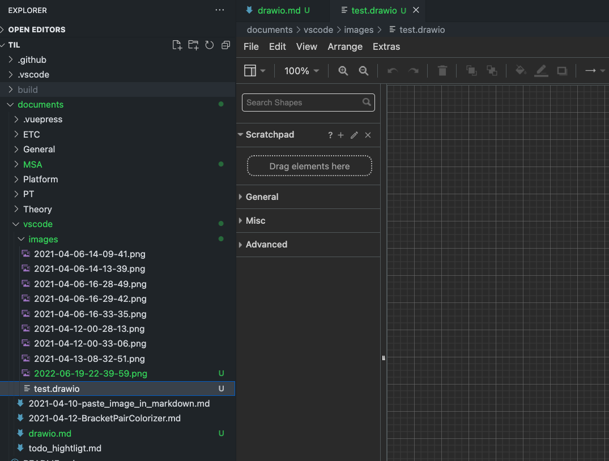
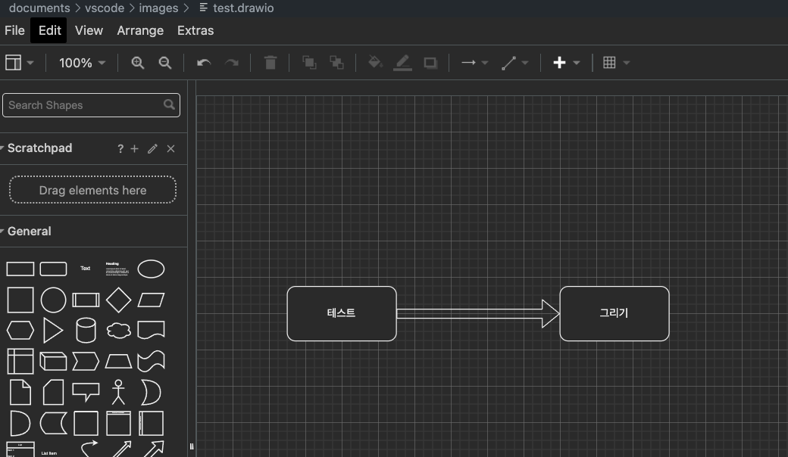
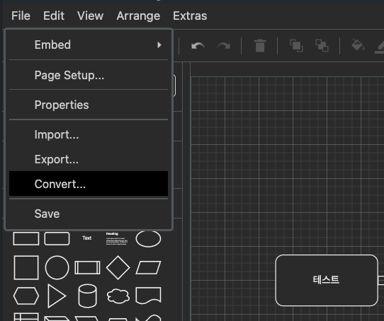
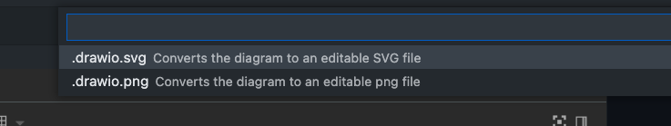
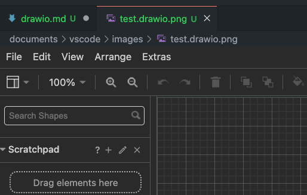

# Drawio

무료로 다이어그램을 그릴 수 있고 이걸 이미지 파일로 convert해서 export까지 해주는 좋은 사이트이다.
[메인 사이트](https://app.diagrams.net/)
해당 사이트를 찾게 되고, 혹시나 vscode에서는 바로 그려볼 수 없을까 하여 찾게 된 것이 아래의 extension!

# in vscode


위의 extension을 설치 하면 사용 할 수 있게 된다.

# 파일 생성 및 그림 그리기

## 파일 생성



- `xxxx.drawio` 파일명으로 파일을 생성하면 vscode에서 draw.io editor를 보여주게 된다!

## 그리기



- web view와 동일하게 그림을 그려서 사용 할 수 있다.
- 사용법은 직관적이기 때문에 별도로 설명 X

## 저장 및 이미지로 저장하기

:::warning
저장만 하면 해당 파일은 txt형태의 파일로만 보인다.
그렇기 때문에 이미지로 저장을 별도로 convert해서 저장해주어야 함.
:::



1. FILE -> CONVERT 선택



2. 변환 하고자 하는 이미지 확장자 선택



3. 확장자가 변환된것을 확인 할 수 있다.
4. 확장자의 경우 위의 방법으로 자유롭게 수정 할 수 있다!

## MD에서 어떻게 쓰나?!

```md

```

- MD의 이미지 불러오기로 사용 하면 쉽게 붙여 넣을 수 있게 된다!


