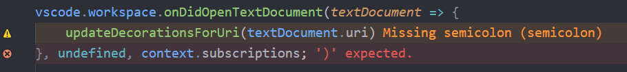

# [Error Lens](https://marketplace.visualstudio.com/items?itemName=usernamehw.errorlens)

코드에 에러가 있을 경우 해당 줄에 오버레이 형식으로 띄워준다.
오타, 괄호 실수, 라이브러리 미참조 등 왠만한 오류는 컴파일이나 실행해보기 전에 이걸로 잡을 수 있다.
vscode를 단순 편집기에서 코딩ide로 업그레이드 해주는 필수 플러그인이다.
다만, 내부적으로 사용 하는 단어같은 경우도 체크 해주기 때문에 vscode에 단어 설정이 번거롭게 들어가야 하는 불편함이 생길 수 있다.

