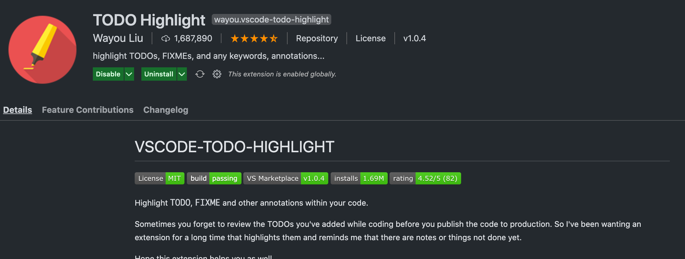
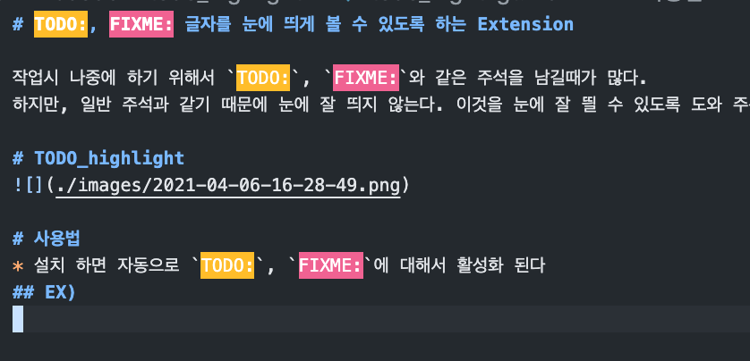
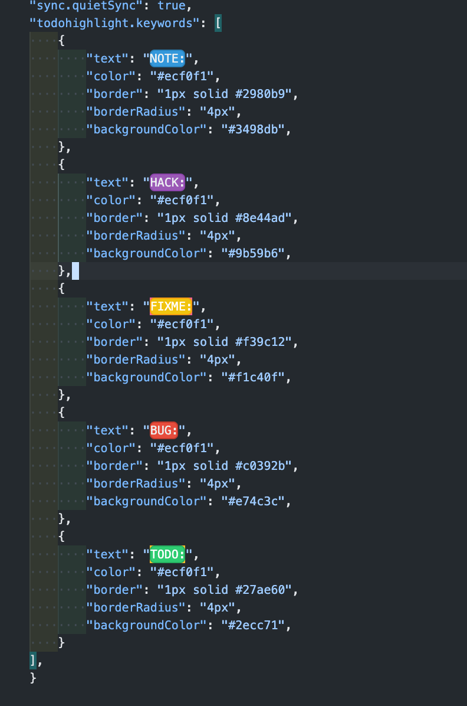

# TODO:, FIXME: 글자를 눈에 띄게 볼 수 있도록 하는 Extension

> 작업시 나중에 하기 위해서 `TODO:`, `FIXME:`와 같은 주석을 남길때가 많다.
> 하지만, 일반 주석과 같기 때문에 눈에 잘 띄지 않는다. 이것을 눈에 잘 띌 수 있도록 도와 주는 Extension을 소개 한다!

# TODO_highlight


# 사용법
* 설치 하면 자동으로 `TODO:`, `FIXME:`에 대해서 활성화 된다
## EX)

* 이후 눈에 잘 띄는 주석을 남길 수 있다.

# 사용하는 Options


```bash
"todohighlight.keywords": [
    {
        "text": "NOTE:",
        "color": "#ecf0f1",
        "border": "1px solid #2980b9",
        "borderRadius": "4px",
        "backgroundColor": "#3498db",
    },
    {
        "text": "HACK:",
        "color": "#ecf0f1",
        "border": "1px solid #8e44ad",
        "borderRadius": "4px",
        "backgroundColor": "#9b59b6",
    },
    {
        "text": "FIXME:",
        "color": "#ecf0f1",
        "border": "1px solid #f39c12",
        "borderRadius": "4px",
        "backgroundColor": "#f1c40f",
    },
    {
        "text": "BUG:",
        "color": "#ecf0f1",
        "border": "1px solid #c0392b",
        "borderRadius": "4px",
        "backgroundColor": "#e74c3c",
    },
    {
        "text": "TODO:",
        "color": "#ecf0f1",
        "border": "1px solid #27ae60",
        "borderRadius": "4px",
        "backgroundColor": "#2ecc71",
    }
],
```